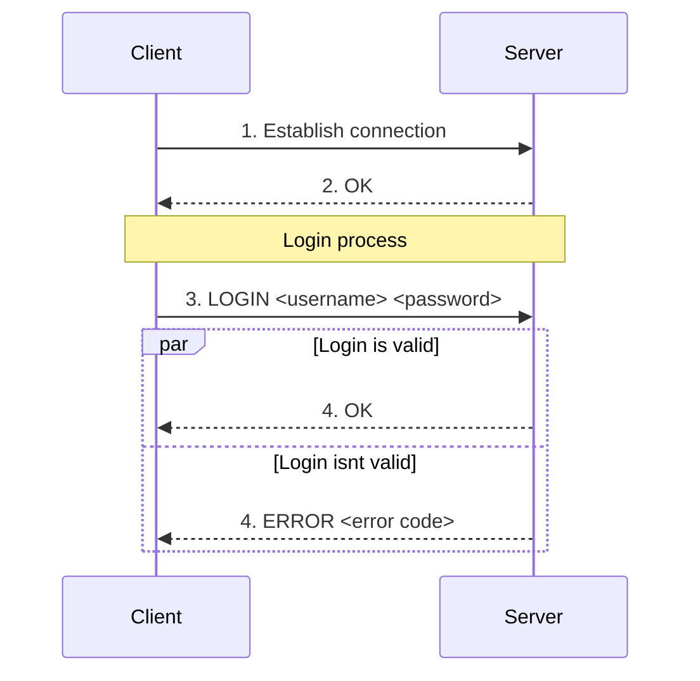
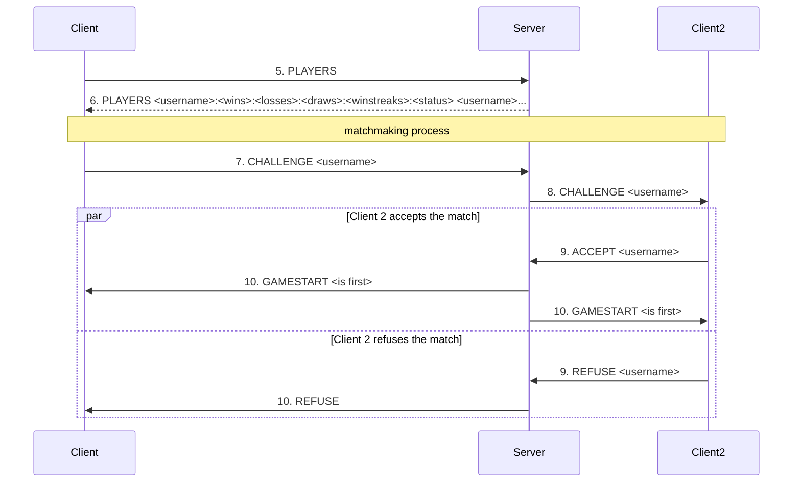
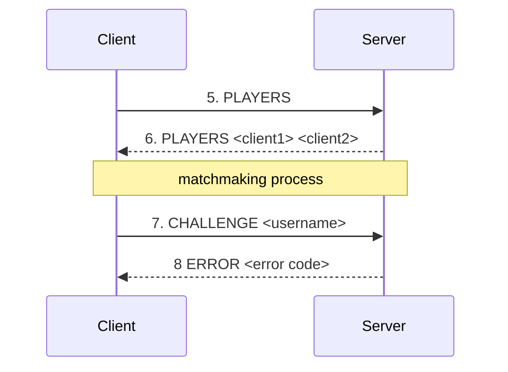
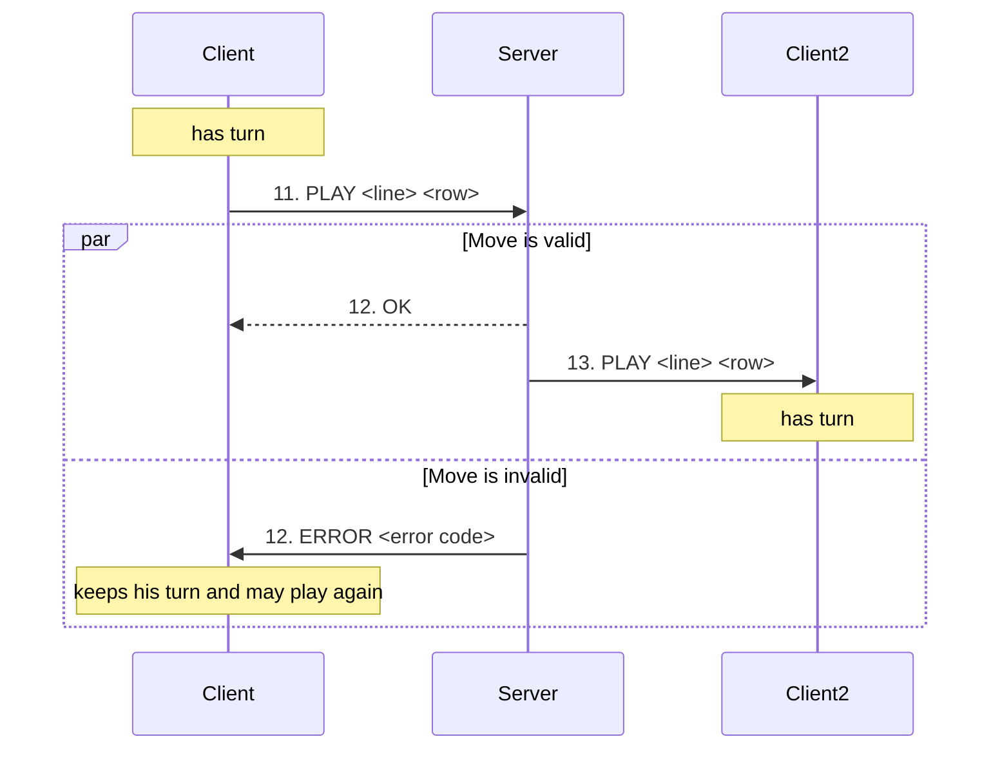
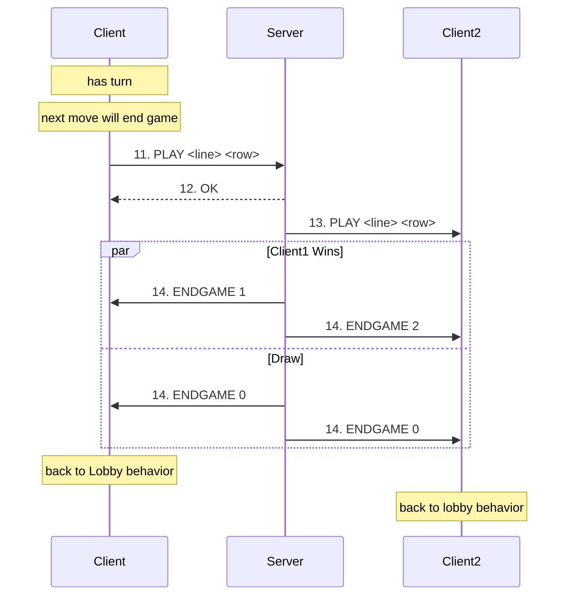
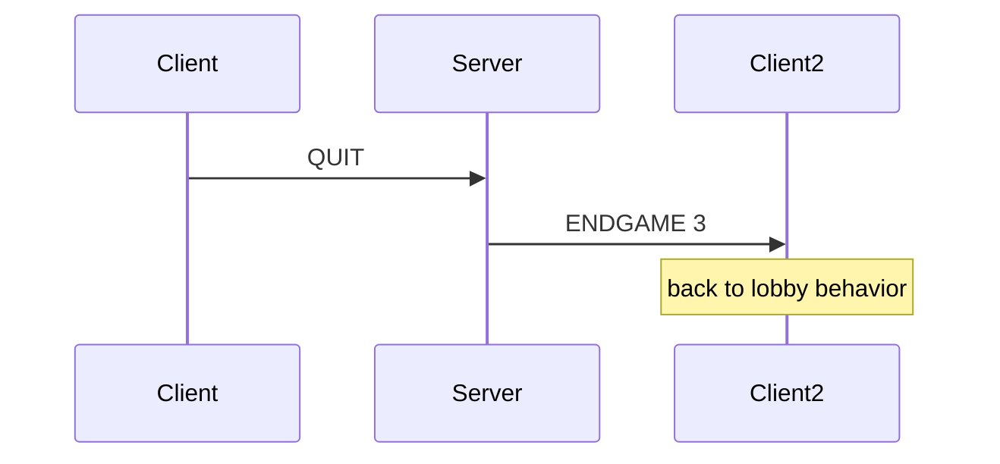

# **DAI 2025 - project 02 - Bader Gabriel Santos Mauro**

Our tic tac toe game is a Java-based command-line application designed to allow users to play against each other online. The project will have a client-server structure, where different clients connect to a server and then are able to match each other.

The key features for this project would be:

- Client can join a server with a username (and a password if he wants to keep his stats)
- Client is put into a lobby where he can see the list of online clients and their status (refreshes every x seconds).
- From the lobby, the client is able to challenge another client to a match
    - Client is able to accept or refuse the challenge

- In game
    - The server will choose a client to play first at random
    - do until someone wins or board is full
        - The client whos turn it is will be able to play
        - When the client plays the server gives the turn to the other player
    - The players’ stats are updated
    - Both players go back to the lobby
- Score keeping (wins / draws / losses / winstreak)
- An average looking game interface for the client

# Building and Running with docker

## 1. Overview

In this section, we will see how to manage and run the application with docker. There is two main options :

- `server` — starts the multithreaded TCP server

- `client` — starts the TCP client


### `server` command

| Option | Long format | Default | Rôle                                |
| ------ | ----------- | ------- | ----------------------------------- |
| `-p`   | `--port`    | `42069` | Define the TCP port                 |
| `-t`   | `--threads` | `12`    | Number of thread (number of player) |
| `-h`   | `--help`    | –       | View help message                   |
| `-V`   | `--version` | –       | View version                        |

### `Client` command

| Option | Long format | Default     | Rôle              |
| ------ | ----------- | ----------- | ----------------- |
| `-H`   | `--host`    | `localhost` | Server host       |
| `-p`   | `--port`    | `42069`     | Server port       |
| `-h`   | `--help`    | –           | View help message |
| `-V`   | `--version` | –           | View version      |


## 2. Dockerfile Used

``` dockerfile
FROM eclipse-temurin:21-jdk 
WORKDIR /app 
COPY target/dai-pw02-bader-santos-1.0-SNAPSHOT.jar app.jar 
EXPOSE 42069 
ENTRYPOINT ["java", "-jar", "app.jar", "server"]
```

### What this Dockerfile does

| Directive                     | Purpose                                     |
| ----------------------------- | ------------------------------------------- |
| `FROM eclipse-temurin:21-jdk` | Uses the official JDK 21 image              |
| `WORKDIR /app`                | Sets `/app` as the working directory        |
| `COPY ... app.jar`            | Copies the  built JAR into the container    |
| `EXPOSE 42069`                | Default TCP port used by the server         |
| `ENTRYPOINT`                  | By default, launches the **server** command |


## 3. Building the Docker Image

Before building, ensure you have compiled your application into a .jar (with maven).

Then build the Docker image:

`docker build -t name-of-the-app .`


## 4. Running the Server in Docker

Start the container:

```bash
sudo docker run -p 42069:42069 ttt-game -p custom_port -t custom_thread
```

Explanation:
- `--p 42069:42069` : map the port to be acessible from outside of the container

- `--name game-server` : names the container

- `-p custom_port` : exposes  a custom TCP port to your host

- `-t custom_thread` : set the number of player (thread) to N


## 5. Connecting a Client to the Dockerized Server

Run it normally outside of Docker:

`java -jar target/dai-pw02-bader-santos-1.0-SNAPSHOT.jar client`

## 6. Full exemple

```bash
# after the app is dockerized

# SERVER SIDE --------------------------------
# Set custom port and custom number of thread
docker run -p 42055:42055 ttt-game -p 42055 -t 8


# CLIENT SIDE --------------------------------
java -jar dai-pw02-bader-santos-1.0-SNAPSHOT.jar client -p 42055

```

# How to publish a container to github registry

In this section, we will see how to publish our image to github registry

See
[github documentation](https://docs.github.com/en/packages/working-with-a-github-packages-registry/working-with-the-container-registry)
for the official documentation
## Step 1 - Log in to GHCR

If you have not logged in yet:

1. Create a GitHub Personal Access Token (classic)  
   Scopes required:
    - `write:packages`
    - `read:packages`
2. Login using your token:

```bash
echo YOUR_GITHUB_PAT | docker login ghcr.io -u Ayc3s --password-stdin
```

`YOUR_GITHUB_PAT` is your new token

## Step 2 - Tag your local image for GHCR

Docker images must be tagged with:

`ghcr.io/<USERNAME>/<IMAGE_NAME>:<TAG>`

Exemple:

```bash
docker tag ttt-game ghcr.io/ayc3s/ttt-game:release
```

## Step 3 - Push the tagged image to GHCR


`docker push ghcr.io/USERNAME/<IMAGE_NAME>:<TAG>`


Exemple:
``` bash
docker push ghcr.io/ayc3s/ttt-game:release
```


## Application Protocol

### Section 1 - Overview

Tic Tac Toe (TTT) protocol is a protocol that will allows for the user to login to the server, match other players, and play a matches of tic tac toe

### Section 2 - Transport protocol

**Connection**

The TTT protocol is a text message transport protocol. It must use the TCP (Transmission Control Protocol) to ensure the reliability of data transmission and uses port 42069 by default.

Every message must be encoded in UTF-8 and delimited by a newline character (`\n`). The messages are treated as text messages.

The initial connection must be established by the client, And the server should return an Ok signal if connection was established correctly.

The server may return an error code if its full.

Once the connection is established, the client can join the server with a given username and a password.

The server must verify the following

- that the username is not already taken by another user.
- that the password is right

If these conditions are met, the server allows the client to join.

Otherwise, the server denies the client access and closes the connection.

**Lobby**

Then, the client can ask the server for all connected clients.

The server returns the list of all connected clients with their current status, wins, draws, losses and win streak.

The client can challenge another client.

If the client isn’t connected the server will send an error message.

Otherwise the server will notify them that they are being challenged.

The second client can then accept the challenge or refuse them

If the challenge is refused, the server will notify the first client.

Otherwise the server will start a match and then it will pick a user at random to play first.

**Game**

The user who’s turn it is, can now select a spot on the grid

if the move is valid the server will acknowledge the move and give the turn to the other user

Otherwise, the server will refuse the move and the user will have to pick another spot on the board

If the user who is waiting for his turn send a request / move it will be instantly refused by the server

if at any point of the players disconnects, the remaining player should be awarded the win

Once the last move is played, the server will do the following:

- if there’s a winner, the winning client will receive a win message and the other one will receive a losing message server
- if its a tie, both players should recieve a draw message from the server

both players should then ask for the list of all connected and the cycle continues

### Section 3 - Messages

**Login**

The client sends a join message to the server indicating the client's username and an optional password.

**Request**

```
LOGIN <username> <password>
```

- `username`: the user name of the client
- `password`: the password of the client

**Response**

- `OK`: the client has been granted access to the server
- `ERROR <code>`: an error occurred during the join. The error code is an integer between 1 and 2 inclusive. The error codes are as follows:
    - 1: the client's name is already in use
    - 2: password is wrong

**List connected players**

The client sends a message to the server to request the list of connected players.

**Request**

```
PLAYERS
```

**Response**

- `PLAYERS <client1>;<client2>;<client3> ...`: the list of connected clients. The clients are separated by a ";".
    - the individual clients attributes are seperated by <username>:<wins>:<losses>:<draws>:<winstreaks>:<status>, seperated by “,”
        - status is enum and should be the same between server and client

**Challenge player**

The client sends a chalenge to the server indicating the recipient. The server is then responsible for sending the challenge to the recipient.

**Request**

```
CHALLENGE <username>

```

**Response**

- `ERROR <code>`: an error occurred while sending the message. The error code is an integer between 1 and 2 inclusive. The error codes are as follows:
    - 1: the recipient is not connected
    - 2: the recipient is busy

**Accept a challenge**

After receiving a challenge from the server the client may accept as follows

**Request**

```
ACCEPT <username>
```

- `username`: the opponnent’s username

**Response**

- `ERROR <code>`: an error occurred while sending the message. The error code is an integer between 1 and 1 inclusive. The error codes are as follows:
    - 1: user isn’t available
- `GAMESTART` : if the challenge was accepted
- `REFUSE` : if the challenge was declined

**Refuse a challenge (Client)**

After receiving a challenge from the server the client may accept as follows

**Request**

```
REFUSE <username>
```

- `username`: the opponnent’s username

**Refuse a challenge (Server)**

Sent as a response to a CHALLENGE message

**Request**

```
REFUSE
```

**Game Start**

The server indicates to the different client that the game is going to start with their opponent username and a value that indicates if they are first

**Request**

```
GAMESTART <is_first>
```

- `is_first`: is an integer between 1 and 2 inclusive : the codes have the following meanings:
    - 1: the client plays first
    - 2: the client plays second

**Response**

None.

**Play (client)**

The client whose turn it is indicates where the player choose to play. The server then will send that information to the other client.

**Request**

```
PLAY <line> <row>
```

- `line`: is an integer between 0 and 2 inclusive that indicates which line the player wants to play
- `row`: is an integer between 0 and 2 inclusive that indicates which row the player wants to play

**Response**

- `OK`: the move is valid
- `ERROR <code>`:  The error code is an integer between 1 and 1 inclusive. The error codes are as follows:
    - 1: illegal move

**Play (server)**

The redirection from the client’s move to the second client

**Request**

```
PLAY <line> <row>
```

- `line`: is an integer between 0 and 2 inclusive that indicates which line the player played
- `row`: is an integer between 0 and 2 inclusive that indicates which row the player played

**Response**

its usually followed by another play message from the client

**Game end**

The server indicates both clients that their game is over and send them the result.

- this might also be called in case of a disconnection.

**Request**

```
GAMEOVER <code>
```

- `code`: is an integer between 0 and 3 inclusive that indicates the result of the match. the codes have the following meaning:
    - 0 : draw
    - 1 : client won
    - 2 : client lost
    - 3 : opposing client disconnected

**Response**

None.

### Section 4 - Examples

**First connection and login**



**Lobby and Matchmaking (nominal case)**



**Lobby and Matchmaking (missing player)**



**Game (playing moves)**



**Game (End)**



**Game (Disconnection)**



# Use of AI

In this project, the only use of AI was to simplify our writing such as the readme and the comments in the code.
